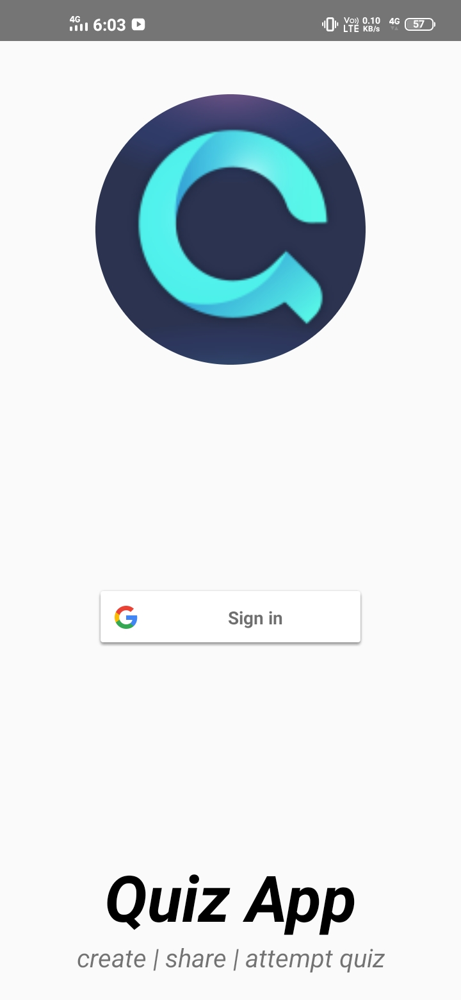

# Quiz - create | attempt

This is an quiz app where users can create their own quizzes and upload to firebase server and from there any user can attempt his quiz.
This app will make our learning fun as we can attempt any quiz of our choice.

## Tech Stack

**Client:** Android studio, glide library, etc.

**Server:** Google signin Authentication, realtime database, Firebase storage.

## Screenshots

